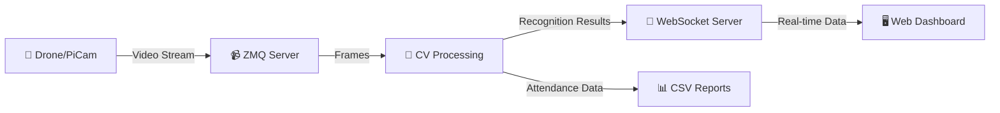

# 🎓 Uhm-azing Classroom

<div align="center">
  
  <h1>🎓 Uhm-azing Classroom</h1>
  
  ### An all-in-one computer vision-based smart classroom platform
  
  <p>
    <strong>Automating Education with Computer Vision</strong>
  </p>
  
  [](LICENSE)
  [](https://www.python.org/)
  [](https://opencv.org/)
  [](https://pytorch.org/)
  
</div>

---

## 🚀 Overview

**Uhm-azing Classroom (엄청난 강의실)** is a smart classroom platform that automates and assists repetitive tasks in lecture environments using cutting-edge computer vision technologies. Our system supports face-recognition attendance, real-time lecture material interaction, and random presenter selection—all in one seamless pipeline.

### 💡 What Makes Us Special

- 🎯 **Automated Attendance**: Face recognition-based attendance system
- 🖐️ **Interactive Lectures**: Hand gesture-controlled pointer and slides
- 🎲 **Fair Selection**: Random presenter selection from detected students
- 🚁 **Flexible Input**: Supports both drone and Raspberry Pi camera inputs

---

## 🎨 Our Projects

<table>
  <tr>
    <td align="center" width="33%">
      <h2>🎓</h2>
      <h3>Uhm-Tendance</h3>
      <p><b>Face Recognition Attendance</b></p>
      <p>Automated attendance checking using PyTorch CNN models</p>
      <a href="https://github.com/ICV-Team4/Uhm-Tendance">
        
      </a>
    </td>
    <td align="center" width="33%">
      <h2>🖐️</h2>
      <h3>Pow-Uhm Point</h3>
      <p><b>Interactive Lecture System</b></p>
      <p>Hand gesture recognition for pointer and slide control</p>
      <a href="https://github.com/ICV-Team4/pa-Uhm-point">
        
      </a>
    </td>
    <td align="center" width="33%">
      <h2>🎲</h2>
      <h3>Pick Me, Uhm!</h3>
      <p><b>Presenter Selection System</b></p>
      <p>Random selection from crowd-detected students</p>
      <a href="https://github.com/ICV-Team4/pick-me-uhm-server">
        
      </a>
    </td>
  </tr>
</table>

---

## 🛠️ Tech Stack

<div align="center">

### Core Technologies

<p>
  
  
  
  
</p>

### Infrastructure

<p>
  
  
  
  
</p>

### Frontend

<p>
  
  
  
</p>

</div>

---

## 📊 System Architecture



### How It Works

| Component | Input | Processing | Output |
|-----------|-------|------------|--------|
| **Uhm-Tendance** | Video frames | PyTorch CNN + Face Recognition | Attendance records |
| **Pow-Uhm Point** | Video frames | MediaPipe + Hand Tracking | Pointer coordinates |
| **Pick Me, Uhm!** | Video frames | OpenCV + Object Detection | Selected student |

---

## 👥 Team Members

<table align="center">
  <tr>
    <td align="center" width="14.28%">
      <a href="https://github.com/username1">
        
        <br /><sub><b>김태화</b></sub>
      </a>
      <br />📝 Documentation
    </td>
    <td align="center" width="14.28%">
      <a href="https://github.com/username2">
        
        <br /><sub><b>김태량</b></sub>
      </a>
      <br />🖐️ Gesture Recognition
    </td>
    <td align="center" width="14.28%">
      <a href="https://github.com/username3">
        
        <br /><sub><b>박형빈</b></sub>
      </a>
      <br />🖐️ Hand Tracking
    </td>
    <td align="center" width="14.28%">
      <a href="https://github.com/username4">
        
        <br /><sub><b>이찬</b></sub>
      </a>
      <br />🎓 Attendance System
    </td>
    <td align="center" width="14.28%">
      <a href="https://github.com/username5">
        
        <br /><sub><b>홍석진</b></sub>
      </a>
      <br />🎲 Presenter Selection
    </td>
    <td align="center" width="14.28%">
      <a href="https://github.com/username6">
        
        <br /><sub><b>손찬수</b></sub>
      </a>
      <br />🚁 Hardware Setup
    </td>
    <td align="center" width="14.28%">
      <a href="https://github.com/username7">
        
        <br /><sub><b>손인화</b></sub>
      </a>
      <br />🎓 Face Recognition
    </td>
  </tr>
  <tr>
    <td align="center" colspan="7">
      <a href="https://github.com/username8">
        
        <br /><sub><b>이가은</b></sub>
      </a>
      <br />💻 Web Development
    </td>
  </tr>
</table>

---

## 🎯 Key Features

### 🎓 Uhm-Tendance (Face Recognition Attendance)

```python
# Real-time attendance tracking
- PyTorch-based CNN classification
- ZMQ video stream processing
- WebSocket broadcasting
- CSV report generation
```

**Technologies**: OpenCV, PyTorch, ZMQ, WebSocket

### 🖐️ Pow-Uhm Point (Interactive Lecture Material)

```python
# Gesture-based slide control
- Hand keypoint detection
- Gesture classification
- Pointer coordinate mapping
- Slide navigation control
```

**Technologies**: OpenCV, MediaPipe, Hand Tracking

### 🎲 Pick Me, Uhm! (Random Presenter Selection)

```python
# Fair student selection
- Crowd detection
- Student counting
- Random selection algorithm
- Visual feedback system
```

**Technologies**: OpenCV, Object Detection, DNN

---

## 🚀 Quick Start

### Prerequisites

```bash
# Python 3.8 or higher
python --version

# Install dependencies
pip install -r requirements.txt
```

### Installation

```bash
# Clone the repository
git clone https://github.com/your-org/uhm-azing-classroom.git
cd uhm-azing-classroom

# Set up virtual environment
conda create -n icv python=3.8
conda activate icv

# Install packages
pip install opencv-python torch torchvision mediapipe websockets pyzmq
```

### Running the System

```bash
# 1. Start AI Server
python 03_run_attendance_server.py

# 2. Start Camera Client (Drone/PiCam)
python zmq_client.py

# 3. Open Web Dashboard
# Navigate to ws://localhost:5556
```

---

## 📚 Documentation

- [📖 Full Documentation](https://github.com/your-org/uhm-azing-classroom/wiki)
- [🎥 Demo Video](https://youtube.com/your-demo)
- [📊 Project Proposal](docs/proposal.pdf)
- [🔧 API Reference](docs/api.md)

---

## 🎬 Demo

<div align="center">
  
  ### 🎥 Live Demonstration
  
  <p>
    <i>실제 강의실 환경에서 테스트된 실시간 시스템</i>
  </p>
  
  <table>
    <tr>
      <td align="center">
        <h4>📹 Attendance System</h4>
        <p>Real-time face recognition</p>
      </td>
      <td align="center">
        <h4>👋 Gesture Control</h4>
        <p>Interactive slide navigation</p>
      </td>
      <td align="center">
        <h4>🎲 Random Selection</h4>
        <p>Fair presenter picking</p>
      </td>
    </tr>
  </table>
  
</div>

---

## 🤝 Contributing

We welcome contributions! Please check out our [Contributing Guidelines](CONTRIBUTING.md).

1. Fork the Project
2. Create your Feature Branch (`git checkout -b feature/AmazingFeature`)
3. Commit your Changes (`git commit -m 'Add some AmazingFeature'`)
4. Push to the Branch (`git push origin feature/AmazingFeature`)
5. Open a Pull Request

---

## 📫 Contact

<div align="center">

### Get In Touch

<p>
  <a href="mailto:team4@uhmcv.com">
    
  </a>
  <a href="https://discord.gg/your-invite">
    
  </a>
  <a href="https://your-website.com">
    
  </a>
</p>

**Project Link**: [https://github.com/your-org/uhm-azing-classroom](https://github.com/your-org/uhm-azing-classroom)

</div>

---

## 📜 License

This project is licensed under the MIT License - see the [LICENSE](LICENSE) file for details.

---

## 🙏 Acknowledgments

- Computer Vision Course, University
- Professor Uhm and Teaching Assistants
- All team members for their dedication
- Open source community

---

<div align="center">
  
  ### 🌟 Star us on GitHub — it motivates us a lot!
  
  <sub>Built with ❤️ by Team 4 | Computer Vision Term Project</sub>
  
  <p>
    <a href="#top">⬆️ Back to Top</a>
  </p>
  
</div>